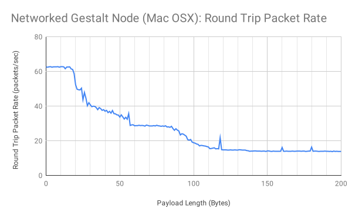
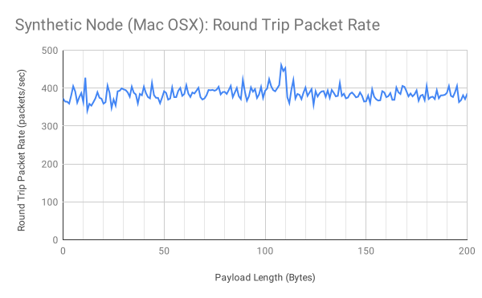

## Packet Communication Rates
Many applications require rapid back-and-forth communication between the virtual and physical nodes. This is particularly true for motion control, where the rate and complexity at which a machine can move may be limited by how quickly it can receive commands. In this study we measured round-trip packet rates as a function of payload size. Example applications might be to estimate how rapidly path information can be pushed to a multi-axis machine based on packet length and number of nodes, or at what rate real-time sensor data can be read.

### Test Procedure
We'll focus here on showing you how to run the tests yourself. All code, including firmware and virtual nodes for both an Arduino Uno and an Atmega328-based Networked Node, are located in the [examples directory here.](https://github.com/imnp/pygestalt/tree/master/examples/communicationsTest)

#### 1. Load the Correct Firmware
If you are testing an Arduino Uno -based node, you'll do this via the Arduino IDE. 

If you are testing a networked Gestalt node, you need to comment and uncomment a few lines in _runCommTest.py_.

Uncomment the line where _testNode_ is defined as a _networkedGestaltNode_ (and comment out where it's defined as an _arduinoGestaltNode_):

```python
#testNode = nodes.arduinoGestaltNode(name = "Comm. Test Node", filename = "arduinoNode_commTest.py") #filename must be provided for synthetic mode
testNode = nodes.networkedGestaltNode(name = "Comm. Test Node", filename = "gestaltNode_commTest.py") #filename must be provided for synthetic mode
```

Uncomment the "- Load New Firmware -" section at the bottom, and comment the "- Run Test -" section:
```python
# ---- LOAD NEW FIRMWARE ----
testNode.loadProgram('firmware/gestaltNode_commTest/gestaltNode_commTest.hex')

# ---- RUN TEST ----
# sweepResults = symmetricPayloadSizeSweep(0,200, 100, verbose = True)
# printResult(sweepResults)
# outputResult(sweepResults)
```

Now go ahead and run _runCommTest.py_ from the terminal:

```bash
>> python runCommTest.py
```

This will flash the test firmware onto the networked Gestalt node.


#### 2. Run the Test

Select the type of node you are testing by commenting and uncommenting the correct definition for _testNode_:
```python
testNode = nodes.arduinoGestaltNode(name = "Comm. Test Node", filename = "arduinoNode_commTest.py") #filename must be provided for synthetic mode
#testNode = nodes.networkedGestaltNode(name = "Comm. Test Node", filename = "gestaltNode_commTest.py") #filename must be provided for synthetic mode
```

Comment the "-Load New Firmware-" section, and uncomment the "-Run Test-" section:
```python
# ---- LOAD NEW FIRMWARE ----
#testNode.loadProgram('firmware/gestaltNode_commTest/gestaltNode_commTest.hex')

# ---- RUN TEST ----
sweepResults = symmetricPayloadSizeSweep(0,200, 100, verbose = True)
printResult(sweepResults)
outputResult(sweepResults)
```

Now go ahead and run _runCommTest.py_ from the terminal:
```bash
>> python runCommTest.py
```

The default is to test all payload lengths from 0 to 200 bytes, and to run 100 exchanges per length. You can change these options in the "- Run Test -" section:
```python
# ---- RUN TEST ----
sweepResults = symmetricPayloadSizeSweep(0,200, 100, verbose = True)
```

One last thing... if you are curious how quickly pyGestalt itself is running on your system, you can uncomment the following line at the top of the file:

```python
# config.syntheticModeOn() #Un-comment this line to run in synthetic mode (i.e. test mode)
```
This enables "synthetic mode", which keeps all communication internal to pyGestalt. It's typically useful for testing your code without needing to deal with real hardware, but also is useful in this case to isolate variables and benchmark system performance. 


### Results

This test is measuring _round trip_ packet rates, meaning the time it takes from when a service routine is called on a virtual node (causing a packet to be transmitted), to when the response packet is received and decoded by the virtual node. One additional interesting datapoint is that when the framework runs in "synthetic mode", meaning that packets make the round-trip internally to the pyGestalt framework (i.e. they never hit the virtual serial port), the packet rate is 385/s. This gives an upper bound of how quickly pyGestalt can process packets, independently of the communications network or USB to serial device driver.

In order to help filter out random system noise, 100 round-trip packets were exchanged at each payload length. An average rate was calculated by dividing 100 by the total time required to complete. Note that there are six bytes of overhead in each packet, so the total packet length is the payload length + 6.





|Payload (Bytes) |Arduino Uno |Networked Gestalt|
|----------------|------------|-----------------|
|0               |93          |63               |
|----------------|------------|-----------------|
|1               |86          |62               |
|----------------|------------|-----------------|
|2               |82          |63               |
|----------------|------------|-----------------|
|3               |73          |63               |
|----------------|------------|-----------------|
|4               |70          |62               |
|----------------|------------|-----------------|
|5               |63          |63               |
|----------------|------------|-----------------|
|6               |59          |63               |
|----------------|------------|-----------------|
|7               |56          |63               |
|----------------|------------|-----------------|
|8               |56          |63               |
|----------------|------------|-----------------|
|9               |56          |62               |
|----------------|------------|-----------------|
|10              |56          |63               |
|----------------|------------|-----------------|
|11              |56          |63               |
|----------------|------------|-----------------|
|12              |57          |63               |
|----------------|------------|-----------------|
|13              |56          |62               |
|----------------|------------|-----------------|
|14              |55          |63               |
|----------------|------------|-----------------|
|15              |54          |63               |
|----------------|------------|-----------------|
|16              |50          |63               |
|----------------|------------|-----------------|
|17              |44          |61               |
|----------------|------------|-----------------|
|18              |43          |61               |
|----------------|------------|-----------------|
|19              |38          |59               |
|----------------|------------|-----------------|
|20              |35          |52               |
|----------------|------------|-----------------|
|21              |32          |50               |
|----------------|------------|-----------------|
|22              |31          |49               |
|----------------|------------|-----------------|
|23              |29          |49               |
|----------------|------------|-----------------|
|24              |29          |50               |
|----------------|------------|-----------------|
|25              |29          |44               |
|----------------|------------|-----------------|
|26              |29          |48               |
|----------------|------------|-----------------|
|27              |29          |45               |
|----------------|------------|-----------------|
|28              |29          |40               |
|----------------|------------|-----------------|
|29              |29          |42               |
|----------------|------------|-----------------|
|30              |28          |41               |
|----------------|------------|-----------------|
|31              |29          |40               |
|----------------|------------|-----------------|
|32              |29          |40               |
|----------------|------------|-----------------|
|33              |29          |40               |
|----------------|------------|-----------------|
|34              |28          |39               |
|----------------|------------|-----------------|
|35              |29          |38               |
|----------------|------------|-----------------|
|36              |29          |39               |
|----------------|------------|-----------------|
|37              |29          |39               |
|----------------|------------|-----------------|
|38              |29          |38               |
|----------------|------------|-----------------|
|39              |29          |38               |
|----------------|------------|-----------------|
|40              |29          |37               |
|----------------|------------|-----------------|
|41              |29          |38               |
|----------------|------------|-----------------|
|42              |29          |36               |
|----------------|------------|-----------------|
|43              |29          |37               |
|----------------|------------|-----------------|
|44              |28          |36               |
|----------------|------------|-----------------|
|45              |28          |37               |
|----------------|------------|-----------------|
|46              |28          |36               |
|----------------|------------|-----------------|
|47              |26          |36               |
|----------------|------------|-----------------|
|48              |25          |35               |
|----------------|------------|-----------------|
|49              |22          |35               |
|----------------|------------|-----------------|
|50              |20          |34               |
|----------------|------------|-----------------|
|51              |19          |35               |
|----------------|------------|-----------------|
|52              |19          |34               |
|----------------|------------|-----------------|
|53              |17          |33               |
|----------------|------------|-----------------|
|54              |16          |34               |
|----------------|------------|-----------------|
|55              |16          |32               |
|----------------|------------|-----------------|
|56              |15          |36               |
|----------------|------------|-----------------|
|57              |15          |29               |
|----------------|------------|-----------------|
|58              |15          |29               |
|----------------|------------|-----------------|
|59              |15          |29               |
|----------------|------------|-----------------|
|60              |15          |29               |
|----------------|------------|-----------------|
|61              |15          |29               |
|----------------|------------|-----------------|
|62              |15          |29               |
|----------------|------------|-----------------|
|63              |15          |29               |
|----------------|------------|-----------------|
|64              |15          |29               |
|----------------|------------|-----------------|
|65              |15          |29               |
|----------------|------------|-----------------|
|66              |15          |29               |
|----------------|------------|-----------------|
|67              |15          |28               |
|----------------|------------|-----------------|
|68              |15          |29               |
|----------------|------------|-----------------|
|69              |15          |29               |
|----------------|------------|-----------------|
|70              |15          |29               |
|----------------|------------|-----------------|
|71              |15          |29               |
|----------------|------------|-----------------|
|72              |15          |29               |
|----------------|------------|-----------------|
|73              |15          |29               |
|----------------|------------|-----------------|
|74              |14          |29               |
|----------------|------------|-----------------|
|75              |14          |29               |
|----------------|------------|-----------------|
|76              |14          |29               |
|----------------|------------|-----------------|
|77              |14          |29               |
|----------------|------------|-----------------|
|78              |14          |28               |
|----------------|------------|-----------------|
|79              |14          |29               |
|----------------|------------|-----------------|
|80              |14          |28               |
|----------------|------------|-----------------|
|81              |14          |29               |
|----------------|------------|-----------------|
|82              |14          |28               |
|----------------|------------|-----------------|
|83              |14          |28               |
|----------------|------------|-----------------|
|84              |14          |28               |
|----------------|------------|-----------------|
|85              |15          |28               |
|----------------|------------|-----------------|
|86              |15          |27               |
|----------------|------------|-----------------|
|87              |15          |26               |
|----------------|------------|-----------------|
|88              |15          |27               |
|----------------|------------|-----------------|
|89              |15          |26               |
|----------------|------------|-----------------|
|90              |15          |26               |
|----------------|------------|-----------------|
|91              |15          |23               |
|----------------|------------|-----------------|
|92              |15          |24               |
|----------------|------------|-----------------|
|93              |15          |24               |
|----------------|------------|-----------------|
|94              |15          |23               |
|----------------|------------|-----------------|
|95              |15          |23               |
|----------------|------------|-----------------|
|96              |15          |21               |
|----------------|------------|-----------------|
|97              |15          |20               |
|----------------|------------|-----------------|
|98              |15          |21               |
|----------------|------------|-----------------|
|99              |15          |19               |
|----------------|------------|-----------------|
|100             |15          |19               |
|----------------|------------|-----------------|
|101             |15          |19               |
|----------------|------------|-----------------|
|102             |15          |18               |
|----------------|------------|-----------------|
|103             |15          |18               |
|----------------|------------|-----------------|
|104             |15          |17               |
|----------------|------------|-----------------|
|105             |15          |17               |
|----------------|------------|-----------------|
|106             |15          |17               |
|----------------|------------|-----------------|
|107             |15          |17               |
|----------------|------------|-----------------|
|108             |14          |17               |
|----------------|------------|-----------------|
|109             |14          |17               |
|----------------|------------|-----------------|
|110             |13          |16               |
|----------------|------------|-----------------|
|111             |13          |15               |
|----------------|------------|-----------------|
|112             |11          |16               |
|----------------|------------|-----------------|
|113             |11          |16               |
|----------------|------------|-----------------|
|114             |10          |16               |
|----------------|------------|-----------------|
|115             |10          |15               |
|----------------|------------|-----------------|
|116             |10          |15               |
|----------------|------------|-----------------|
|117             |9           |15               |
|----------------|------------|-----------------|
|118             |9           |22               |
|----------------|------------|-----------------|
|119             |9           |15               |
|----------------|------------|-----------------|
|120             |9           |15               |
|----------------|------------|-----------------|
|121             |9           |15               |
|----------------|------------|-----------------|
|122             |8           |15               |
|----------------|------------|-----------------|
|123             |9           |15               |
|----------------|------------|-----------------|
|124             |9           |15               |
|----------------|------------|-----------------|
|125             |9           |15               |
|----------------|------------|-----------------|
|126             |9           |15               |
|----------------|------------|-----------------|
|127             |9           |15               |
|----------------|------------|-----------------|
|128             |9           |15               |
|----------------|------------|-----------------|
|129             |8           |15               |
|----------------|------------|-----------------|
|130             |8           |15               |
|----------------|------------|-----------------|
|131             |8           |15               |
|----------------|------------|-----------------|
|132             |8           |15               |
|----------------|------------|-----------------|
|133             |8           |15               |
|----------------|------------|-----------------|
|134             |8           |15               |
|----------------|------------|-----------------|
|135             |8           |15               |
|----------------|------------|-----------------|
|136             |8           |14               |
|----------------|------------|-----------------|
|137             |8           |14               |
|----------------|------------|-----------------|
|138             |8           |14               |
|----------------|------------|-----------------|
|139             |8           |14               |
|----------------|------------|-----------------|
|140             |8           |14               |
|----------------|------------|-----------------|
|141             |8           |14               |
|----------------|------------|-----------------|
|142             |8           |14               |
|----------------|------------|-----------------|
|143             |8           |14               |
|----------------|------------|-----------------|
|144             |8           |14               |
|----------------|------------|-----------------|
|145             |8           |14               |
|----------------|------------|-----------------|
|146             |8           |14               |
|----------------|------------|-----------------|
|147             |8           |14               |
|----------------|------------|-----------------|
|148             |8           |14               |
|----------------|------------|-----------------|
|149             |8           |14               |
|----------------|------------|-----------------|
|150             |8           |14               |
|----------------|------------|-----------------|
|151             |8           |14               |
|----------------|------------|-----------------|
|152             |8           |14               |
|----------------|------------|-----------------|
|153             |8           |14               |
|----------------|------------|-----------------|
|154             |8           |14               |
|----------------|------------|-----------------|
|155             |8           |14               |
|----------------|------------|-----------------|
|156             |8           |14               |
|----------------|------------|-----------------|
|157             |8           |14               |
|----------------|------------|-----------------|
|158             |8           |14               |
|----------------|------------|-----------------|
|159             |8           |14               |
|----------------|------------|-----------------|
|160             |8           |16               |
|----------------|------------|-----------------|
|161             |8           |14               |
|----------------|------------|-----------------|
|162             |8           |14               |
|----------------|------------|-----------------|
|163             |8           |14               |
|----------------|------------|-----------------|
|164             |8           |14               |
|----------------|------------|-----------------|
|165             |8           |14               |
|----------------|------------|-----------------|
|166             |8           |14               |
|----------------|------------|-----------------|
|167             |8           |14               |
|----------------|------------|-----------------|
|168             |8           |14               |
|----------------|------------|-----------------|
|169             |8           |14               |
|----------------|------------|-----------------|
|170             |8           |14               |
|----------------|------------|-----------------|
|171             |8           |14               |
|----------------|------------|-----------------|
|172             |8           |14               |
|----------------|------------|-----------------|
|173             |8           |14               |
|----------------|------------|-----------------|
|174             |8           |14               |
|----------------|------------|-----------------|
|175             |8           |14               |
|----------------|------------|-----------------|
|176             |8           |14               |
|----------------|------------|-----------------|
|177             |8           |14               |
|----------------|------------|-----------------|
|178             |8           |14               |
|----------------|------------|-----------------|
|179             |8           |14               |
|----------------|------------|-----------------|
|180             |8           |16               |
|----------------|------------|-----------------|
|181             |8           |14               |
|----------------|------------|-----------------|
|182             |8           |14               |
|----------------|------------|-----------------|
|183             |8           |14               |
|----------------|------------|-----------------|
|184             |8           |14               |
|----------------|------------|-----------------|
|185             |8           |14               |
|----------------|------------|-----------------|
|186             |8           |14               |
|----------------|------------|-----------------|
|187             |8           |14               |
|----------------|------------|-----------------|
|188             |8           |14               |
|----------------|------------|-----------------|
|189             |8           |14               |
|----------------|------------|-----------------|
|190             |8           |14               |
|----------------|------------|-----------------|
|191             |8           |14               |
|----------------|------------|-----------------|
|192             |8           |14               |
|----------------|------------|-----------------|
|193             |8           |14               |
|----------------|------------|-----------------|
|194             |8           |14               |
|----------------|------------|-----------------|
|195             |8           |14               |
|----------------|------------|-----------------|
|196             |8           |14               |
|----------------|------------|-----------------|
|197             |8           |14               |
|----------------|------------|-----------------|
|198             |8           |14               |
|----------------|------------|-----------------|
|199             |8           |14               |
|----------------|------------|-----------------|
|200             |8           |14               |
|----------------|------------|-----------------|